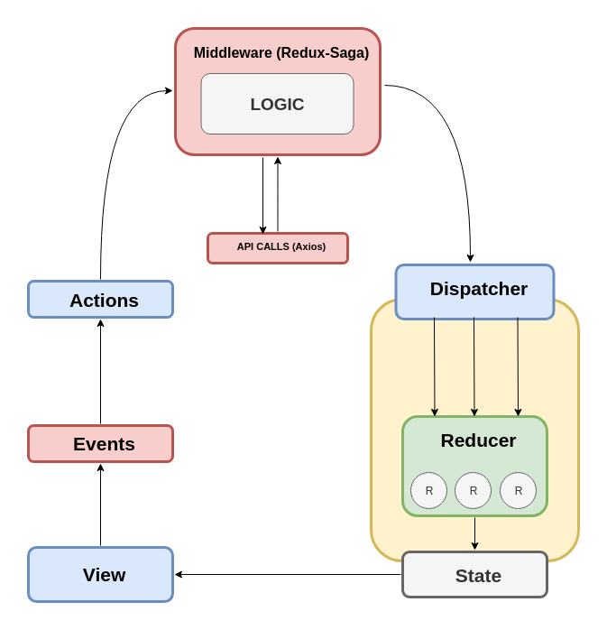
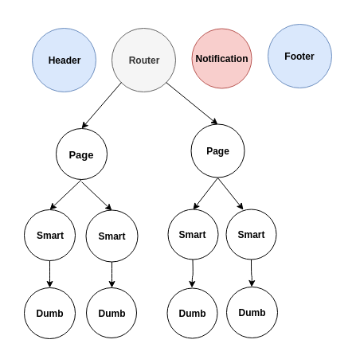
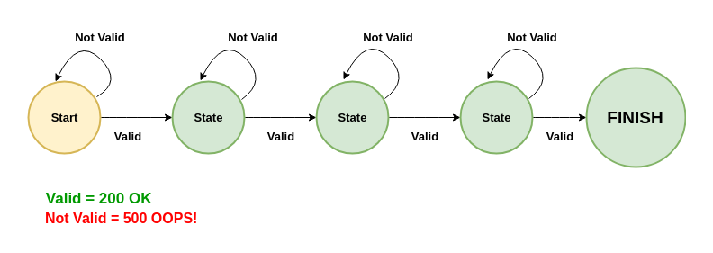
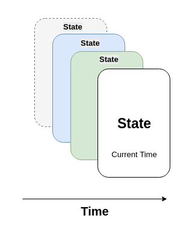

# Zooom Challenge

## Table of Contents

- [Preface](#preface)
- [About](#about)
  * [Motivation](#motivation)
- [Installation](#installation)
  * [Getting Started](#getting-started)
  * [Prerequisites](#prerequisites)
  * [How to Use](#how-to-use)
- [Technology Stack](#technology-stack)
- [How it really works](#how-it-really-works)
  * [View](#view)
  * [Events](#events)
  * [Actions](#actions)
  * [Middleware](#middleware)
  * [API CALLS ](#api-calls)
  * [Dispatcher](#dispatcher)
  * [Reducers](#reducers)
  * [State](#state)
  * [Redux-Saga](#redux-saga)


### Preface

> In order to understand how to maintain and contribute to this project, you must read this document completely
to understand different parts of the project.

### About

#### Motivation

In this project I am looking for these core values:

  - Maintainability
  - Scalability
  - Reliability
  - Efficiency
  - Simplicity
  - Reusability

### Installation

#### Getting Started

These instructions will get you a copy of the project up and running on your local machine for development and testing
 purposes. See deployment for notes on how to deploy the project on a live system.


#### Prerequisites

Before you can start running this project, make sure you have the following software's installed on your machine:

- `Git`
- `Node.js` and `npm`

#### How to Use

In order to grab a copy of the project and run it, you have to clone it via `Git` and then run the following command:

```bash
# Install project dependencies
npm i
```

To start a development server with HMR-enabled:

```bash
# Run a development server on localhost:8585 by default
npm start
```

Other useful commands:

```bash
# Build the project in a development mode
npm run dev

# Build the project in a production mode
npm run build
```

#### Technology Stack
  My technology stack includes:
   * React  | [Read more](https://reactjs.org/)
   * Redux | [Read more](https://redux.js.org/)
   * Redux-Saga | [Read more](https://redux-saga.js.org/)
   * TypeScript | [Read more](https://www.typescriptlang.org/)
   * Babel | [Read more](https://babeljs.io/)
   * Jest | [Read more](https://jestjs.io/)
   * Enzyme | [Read more](https://airbnb.io/enzyme/)
   * Webpack | [Read more](https://webpack.js.org/)
   * CSS Modules | [Read more](https://github.com/css-modules/css-modules)
   * Atomic CSS | [Read more](https://acss.io/)
   * MapboxGL | [Read more](https://www.mapbox.com/mapbox-gl-js/api/)

### How it really works



I am using a one way flow data manipulation in my architecture. In the following you can find the explanation of
each part of the architecture:

#### View

The view of our application just includes the user interface that a client has interaction with. This part of our
application doesn't contain any logic. They only show the data that we send to them and also they fire events when
for example a user click or change inputs. The view part of our application contains Layouts, Pages and Components that 
we have in our application. Each page has two main different part that we call them Dumb and Smart. The Smart component 
will connect to the store and retrieve data and the Dumb component is where we don't have any connection to the store 
and we just show the data.



#### Events

I generally put the event handlers beside the view of each components. When an event fires, the event handler will get
that event and  and as the result event handler will dispatch an action that our component gets as a prop.

#### Actions

I generally connect my components and pages to the store through the connector. This connector gets our original 
component and will return a copy of it, which contains my action creators I need in my component. The new component
will get these action creators as props and I can call them in my component through the props.

#### Middleware



One of the most important parts of my application is my middleware that I have. In the past I used Redux-Thunk,
but it wasn't really good for handling side-effects. Right now I am using Redux-Saga to handle these side effects. It
completely covers my needs in my application. Generally I handle all the logic of my application in this middleware.
This middleware helps me to always have a valid state and also reduce the errors that will happen in my application.
Let's review an example:

Suppose that we need to send a HTTP request to retrieve data from server. When client dispatch an action (Get Ride Report)
in one component, my middleware will get this action, it sends HTTP request through the services I already have in my 
application and waits to get the data, after retrieving the data from server, based on if the response is valid or not,
I can make decision to put the data in my store or not. If the data is valid, I dispatch an action like, 
RIDE_REPORT_FULFILLED and if it isn't valid I dispatch an action like RIDE_REPORT_REJECTED. In this way my state is
always valid and never break down.

#### API CALLS 

All the server call I am using in my application are decoupled from other layers of application. I generally maintain them
in the Services directory. If you need to send a HTTP request to the server you should use these services we already 
in Services directory.

#### Dispatcher

Dispatcher is where I send the data to the store. When I make sure that the data that I get from server is healthy and
there isn't any error in it I dispatch an action which is related to our store. Through this dispatch I send my data
to the store to save it through the Reducers.


#### Reducers

Reducers are pure functions that will return the new state of my application based on the data that they will get.
I generally use functional programming in my reducers to don't mutate any state. Handling the state in this way, 
will give me the ability to know where I am at the current moment in my application.

*NOTE: I ALWAYS RETURN A NEW STATE.*   

#### State



When all changes happened and I got the data I wanted, the state of my application is ready to use. The state of 
the application is separate in time. It is not related to the past, it is not related to the future, it is related to 
RIGHT NOW (Current Moment). If something changed in the state of my application, the connector in our Smart component 
will get this changes and re-renders and updates the component. 
